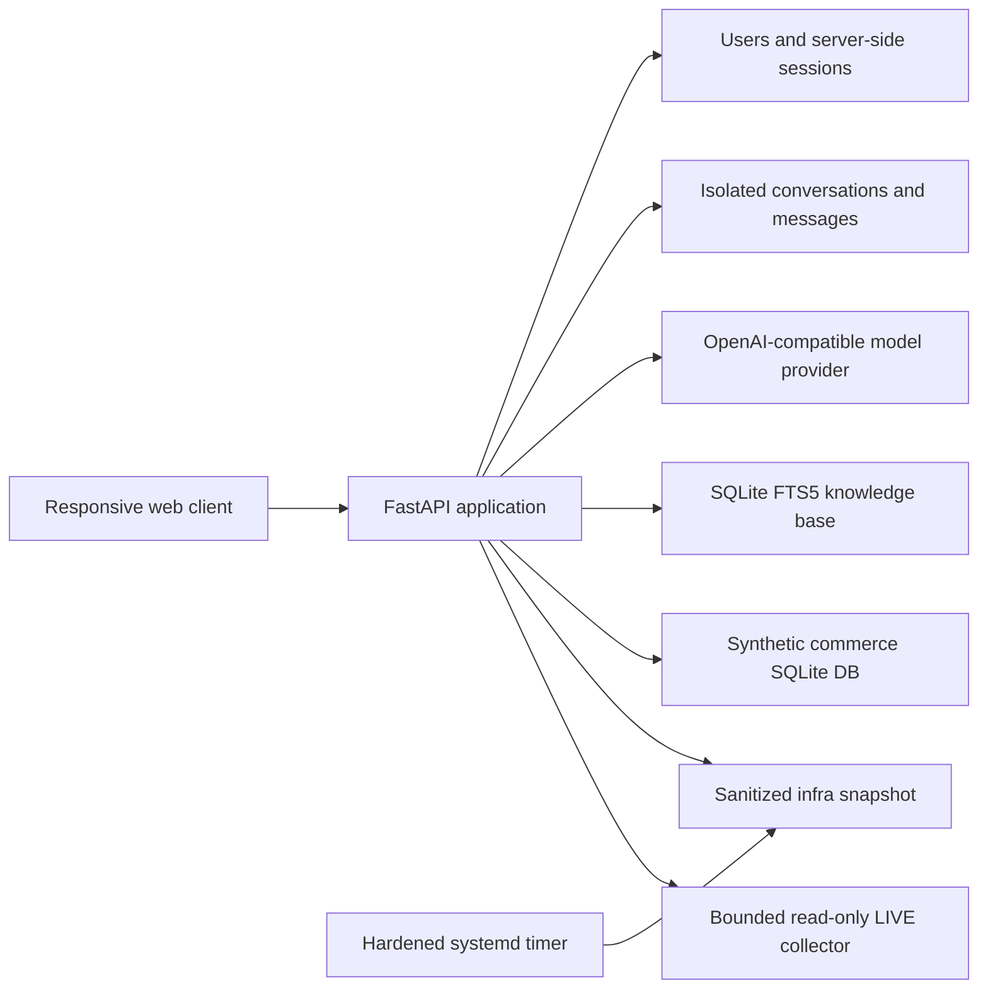
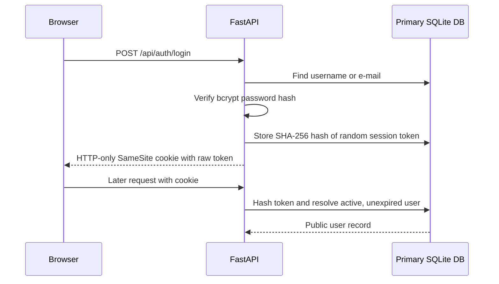
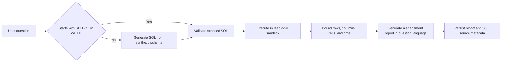

# NexusChat

NexusChat is a private, self-hosted AI workspace built with FastAPI, SQLite, and a responsive vanilla JavaScript frontend. It combines a general assistant, an infrastructure assistant, and a synthetic-data SQL reporting agent in three isolated chat workspaces.

The web interface defaults to English and can be switched to Slovak from both the sign-in screen and the authenticated workspace. The browser remembers the language choice, while assistants answer in the language used by the user.

Live deployment: [raizenko.cloud/nexus](https://raizenko.cloud/nexus/)

## Highlights

- Local accounts with bcrypt password hashing and server-side HTTP-only sessions
- Separate **Nexus**, **Infra**, and **Data** conversations and histories
- OpenAI Responses API support plus OpenAI-compatible Chat Completions endpoints
- Configurable model routing for each agent
- Local SQLite FTS5 retrieval-augmented generation (RAG) with drag-and-drop multi-file ingestion
- Sanitized infrastructure snapshot refreshed by a hardened systemd timer
- Admin-only LIVE Infra checks with a fixed read-only collector and successful-read audit logging
- Synthetic commerce database with natural-language-to-SQL reporting
- SQLite authorizer, query-only mode, time limit, row limit, and function denylist
- Admin control plane for creating username/password user or admin accounts, managing models, RAG, and agent access policies
- Responsive desktop/mobile interface with accessible navigation and status controls
- Built-in English/Slovak interface switch with browser-local persistence
- Atomic user/assistant turn persistence and automatic legacy chat migration

## Agent workspaces

| Workspace | Purpose | Data boundary |
| --- | --- | --- |
| **Nexus** | General analysis, planning, writing, and optional RAG | Conversation history plus selected knowledge-base chunks |
| **Infra** | Server, service, TLS, health, port, memory, load, and disk questions | Sanitized snapshot or admin-only bounded LIVE collection; no arbitrary shell |
| **Data** | Management reports from natural language or direct SQL | A separate, deterministic, fully synthetic SQLite database |

Infra conversations include an in-chat `SNAPSHOT / LIVE` selector. Every successful Infra answer is labeled with its source and collection timestamp. LIVE remains admin-only even when ordinary users are allowed to use the snapshot-based Infra agent.

## Architecture



See [Architecture](docs/ARCHITECTURE.md), [Security](docs/SECURITY.md), and [Deployment](docs/DEPLOYMENT.md) for the detailed design.

## How the code works

### Application composition and HTTP boundary

`nexus.app.create_app()` is the composition root. It creates the FastAPI application and attaches the concrete services to `app.state`: the primary `Store`, model provider, model catalog, synthetic reporting database, Data agent, Infra collectors, cookie policy, and in-memory rate limiter. Tests call the same factory with temporary databases and fake providers, so test traffic follows the production routing and persistence logic.

The HTML, CSS, JavaScript, and JSON API are served from the same origin. This avoids a separate frontend build or cross-origin authentication flow. Before a route runs, middleware:

1. rejects untrusted host headers;
2. rejects state-changing cross-origin requests when `Origin` does not match the effective host;
3. adds CSP, frame, MIME, referrer, permissions, and cross-origin security headers;
4. disables caching for the application shell and API responses.

Authentication and administrator authorization are dependencies, not frontend assumptions. `current_user()` resolves the session and returns `401` when it is missing, expired, or belongs to a disabled user. `admin_user()` builds on that check and returns `403` unless the resolved role is `admin`.

### Authentication and session lifecycle



Application account passwords are stored only as bcrypt hashes. A successful login creates a cryptographically random token with a fixed seven-day expiry, but only its SHA-256 hash is written to SQLite. The browser receives the raw token in an HTTP-only, `SameSite=Lax` cookie. The reference production configuration enables the configurable `Secure` flag; local HTTP development requires disabling it. Logout deletes the hashed session and removes the cookie. Role and activation checks use the current user row on every request, so a role change applies immediately and deactivation makes existing sessions unusable.

Self-registration uses name, e-mail, and password validation. Accounts created from the admin panel use a unique login name and do not require e-mail. Both identity forms are resolved by the same login endpoint. Authentication and registration attempts are rate-limited before password work or account creation occurs.

### Conversation and workspace isolation

The three workspaces are isolated twice:

- The browser keeps separate conversation lists and active conversation IDs for `general`, `infra`, and `data`.
- The server stores `conversations.agent_mode` and treats it as authoritative.

Conversation list requests filter by agent mode. When a message is sent, the requested mode must equal the stored conversation mode; otherwise the API returns `409`. A client therefore cannot turn a Nexus conversation into an Infra or Data conversation by modifying a request. The same ownership lookup always includes the authenticated user ID.

The `/api/capabilities` response determines which agent controls the browser may display for the current user. This is only a usability layer: every privileged operation repeats its role and policy checks on the server.

Legacy mixed-agent histories are migrated during store initialization using the `agent_mode` already stored with each message. The original conversation keeps `general` when present, otherwise its first message mode; each remaining mode receives a new conversation. Message IDs, content, ordering, and timestamps are retained.

### Message request pipeline

All three agents enter through `POST /api/conversations/{id}/messages`:

```text
validate input
  -> authenticate user and verify conversation ownership
  -> verify stored agent mode and current access policy
  -> load runtime settings and choose model/context
  -> execute the selected agent
  -> reject missing or empty output
  -> atomically store the user and assistant messages
```

The model is called before either message is persisted. `Store.add_exchange()` then writes the complete user/assistant pair and updates the conversation timestamp in one SQLite transaction. Provider, RAG, snapshot, LIVE collection, report-generation, or SQL failures therefore do not leave an orphaned user message in chat history. If persistence itself fails after an external call succeeds, the exchange is not committed even though provider usage may already have occurred.

Message submission has no idempotency key. A client that retries after losing the HTTP response cannot prove whether the first request committed, so callers should reload the conversation before retrying uncertain submissions.

The provider receives at most the most recent 24 messages. Each input message is limited to 12,000 characters, and ordinary chat requests are limited to 30 per user per minute.

### Model routing

Runtime settings contain a primary model, an Infra model, and a Data model:

| Agent | Model selection | Additional context |
| --- | --- | --- |
| Nexus | `model` | Optional RAG passages |
| Infra | `infra_model`, falling back to `model` | Snapshot or LIVE server state plus optional RAG passages |
| Data | `data_model`, falling back to `model` | Synthetic schema, generated SQL, and bounded query result |

`OpenAIProvider.reply()` selects the transport. With no `OPENAI_BASE_URL`, it uses the OpenAI Responses API with `store=False`. When a compatible base URL is configured, it uses Chat Completions. The rest of the application sees the same normalized result: response text, model name, input tokens, and output tokens.

### RAG ingestion and retrieval

Uploading files and retrieving passages are deliberately separate operations with separate limits.

#### Ingestion

1. The browser accepts TXT, Markdown, JSON, YAML, CSV, and LOG files through selection or drag and drop.
2. It accepts up to 1,000 files in one selection, enforces 10 MiB per file and 50 MiB for the complete batch, and runs four upload workers.
3. Each file is sent as an independent request. A rejected file does not roll back other successful uploads. While one batch is active, the browser rejects a second batch rather than interleaving both queues.
4. The server normalizes the filename, checks the extension and UTF-8 size, strips null bytes, and rejects empty content.
5. `chunk_text()` groups paragraphs into chunks targeting approximately 1,400 characters.
6. `Store.create_rag_document()` stores document metadata, chunks, and matching FTS5 rows in one transaction.

There is currently no global document-count ceiling. The 1,000-file value is the maximum size of one browser upload selection, not the number of passages sent to a model.

#### Retrieval

For a Nexus or Infra question, `fts_query()` extracts up to 12 meaningful query terms. SQLite FTS5 ranks matching chunks with BM25, and `Store.search_rag()` returns the configured number of best passages. The admin field **Max. passages** controls this per-question retrieval count and is bounded to 1–12. This smaller limit prevents a large knowledge base from flooding the model context.

Retrieved chunks are added to the system prompt with a stable marker such as `[KB:runbook.md#3]`. The assistant is instructed to use only relevant context and cite those markers. Source metadata is also stored with the assistant message so the UI can render the provenance.

### Infra Snapshot and LIVE logic

Both Infra modes use the same conversation workspace but obtain server state differently:

- **SNAPSHOT** reads a sanitized JSON document produced approximately once per minute by a hardened systemd one-shot service and timer.
- **LIVE** calls `collect_infra_state()` during the message request.

The LIVE collector does not accept a command from the user. It executes a fixed set of non-mutating checks without a shell: load and uptime, memory, root-disk usage, approved systemd services, health endpoints, listening TCP port numbers, TLS expiry, and nginx validation. Some checks launch fixed external programs or make fixed local/network health requests; “read-only” means the collector is designed to request state and has no intended mutation path. Command output and execution time are bounded.

Snapshot access follows the `infra_agent_admin_only` policy. LIVE is stricter: it is permitted only when Infra is enabled, LIVE is enabled, and the authenticated user is an administrator. The API enforces a separate rate limit of 10 LIVE reads per user per minute and records every successful read as an `infra.live.read` audit event. Denied or failed LIVE attempts are not written to this application audit table, although service logs may record failures. The source mode and generation timestamp are stored with a successful assistant response.

The model receives only the serialized sanitized state and explicit instructions not to claim it ran commands or changed the server. Neither mode provides an interactive shell.

### Data agent logic

The Data agent never opens the Nexus application database. It uses a separate SQLite database seeded with deterministic fictional commerce and support data.



Only one `SELECT` or `WITH` statement is accepted. The validator rejects mutation, DDL, PRAGMA, attach, transaction, and multi-statement input. Execution adds several independent controls:

- URI `mode=ro` and `PRAGMA query_only=ON`;
- a SQLite authorizer that denies mutation opcodes and unsafe functions;
- a 1.5-second progress-handler limit;
- at most 100 returned rows, 64 columns by default, and 8,000 characters per text cell by default.

The `SELECT`/`WITH` prefix is not the only write control: SQLite's authorizer still evaluates operations inside compound statements and denies mutation opcodes. Limits passed by internal callers are clamped to hard ceilings of 100 rows, 128 columns, and 16,000 characters per cell.

For natural-language questions, the model gets the synthetic schema and produces SQL. Leading whitespace is ignored when detecting direct `SELECT`/`WITH` input, but a leading SQL comment is not treated as direct SQL and will enter the natural-language planning path. If validation or SQLite execution raises `QueryRejected`—including authorizer denial or a progress-handler interruption—the agent may make one repair attempt using the sanitized error. Direct SQL is never automatically rewritten. A second model call converts the bounded result into a finished report and must use the language of the original user request. If that report call fails, no chat exchange is stored. The stored source metadata for a successful report includes the executed SQL, row count, truncation flags, and elapsed time.

### Admin settings and unsaved changes

The settings screen edits one logical configuration object even though its controls appear in several cards. Model IDs, system instructions, RAG policy, Infra policy, and Data policy are collected by `settingsPayload()` and written through one `PUT /api/admin/settings` request.

Any edited field sets `state.settingsDirty`. While that flag is active:

- changing the interface language or revisiting Administration does not overwrite the draft with server values;
- a sticky Save/Discard bar remains visible;
- signing out asks for confirmation, while reload/close navigation requests the browser's standard `beforeunload` warning (the browser may show generic text or suppress it);
- toggling an agent or RAG no longer silently saves unrelated draft fields.

Discard confirms the action, clears the dirty state, and reloads the last server values. After a successful save, capabilities are reloaded so agent visibility immediately matches the new server policy. Failed saves keep the draft visible and show an error rather than replacing it with older data.

The draft exists only in the current tab's memory. It does not survive a confirmed reload, synchronize across tabs, or use optimistic version checks. Every save submits the complete settings snapshot and upserts every key, so a stale tab can overwrite unrelated changes from another administrator; the last complete save wins.

### Persistence and migration logic

The primary database stores identity, sessions, conversations, messages, runtime settings, audit records, and the RAG index. Schema initialization is idempotent: missing tables, columns, indexes, the FTS5 table, and default settings are created when the application starts. These are forward-only startup migrations; there is no automatic downgrade or schema rollback, so production upgrades should start with a SQLite backup.

SQLite connection context managers provide commit/rollback behavior. Multi-row operations such as a complete chat exchange or RAG document plus its chunks are transaction-scoped. Foreign keys and explicit ownership predicates protect relationships at both database and query levels.

### Main API surface

| Area | Endpoints | Guard |
| --- | --- | --- |
| Health | `GET /health` | Public |
| Authentication | `/api/auth/register`, `/login`, `/logout`, `/me` | Rate limit and/or session |
| Capabilities | `GET /api/capabilities` | Session |
| Conversations | `/api/conversations`, `/api/conversations/{id}` | Session, owner, agent mode |
| Messages | `POST /api/conversations/{id}/messages` | Session, owner, mode, agent policy, rate limits |
| Users | `/api/admin/users` | Administrator |
| Settings and models | `/api/admin/settings`, `/api/admin/models` | Administrator |
| RAG | `/api/admin/rag/documents` | Administrator |
| Infra status | `/api/admin/infra/status` | Administrator |
| Synthetic schema | `/api/admin/data/schema` | Administrator |

FastAPI's interactive OpenAPI endpoints are disabled in this private deployment. Route payloads are still validated by Pydantic models in `nexus/app.py`.

### Safe extension points

- **New agent mode:** extend the Pydantic literals, conversation migration rules, capability response, message router, frontend state maps, and isolation tests together.
- **New Infra metric:** add a fixed collector function with no user-controlled subprocess arguments, include only sanitized output, and update Infra tests.
- **New synthetic table:** add deterministic seed data and relationships in `SyntheticDatabase`, then expose it through `schema_prompt()` and add SQL sandbox tests.
- **New RAG file type:** update both `ALLOWED_EXTENSIONS` in `nexus/rag.py` and the frontend file input, then add validation and browser tests.
- **New runtime setting:** add a default in `Store`, Pydantic validation, admin serialization, dirty-state tracking, and API/UI tests.

These changes should preserve the existing rule that authorization and safety boundaries live on the server even when the frontend also validates or hides a control.

## Technology stack

- Python 3.13
- FastAPI and Uvicorn
- SQLite, FTS5, and SQLite authorizer callbacks
- OpenAI Python SDK
- bcrypt
- Vanilla HTML, CSS, and JavaScript
- pytest and Playwright
- systemd and nginx for the reference deployment

## Quick start

### 1. Create an environment

```bash
python -m venv .venv
```

PowerShell:

```powershell
.\.venv\Scripts\Activate.ps1
python -m pip install -r requirements-dev.txt
Copy-Item .env.example .env
```

Linux/macOS:

```bash
source .venv/bin/activate
python -m pip install -r requirements-dev.txt
cp .env.example .env
```

Export the values from `.env` through your shell or process manager. At minimum, configure `OPENAI_API_KEY`, `NEXUS_DATABASE`, and `NEXUS_SECURE_COOKIES`.

### 2. Create an administrator

```bash
python -m nexus.cli --database ./data/nexus.sqlite3 create-admin \
  --name "Nexus Admin" \
  --email "admin@example.com" \
  --password "replace-with-a-strong-password"
```

### 3. Start the application

PowerShell:

```powershell
$env:NEXUS_DATABASE="$PWD\data\nexus.sqlite3"
$env:NEXUS_SYNTHETIC_DATABASE="$PWD\data\synthetic-business.sqlite3"
$env:NEXUS_INFRA_SNAPSHOT="$PWD\data\infra-snapshot.json"
$env:NEXUS_SECURE_COOKIES="0"
python -m uvicorn nexus.app:app --reload
```

Open [http://127.0.0.1:8000/](http://127.0.0.1:8000/).

The synthetic reporting database is created and seeded automatically. Infra snapshot requests return a clear unavailable-state response until a snapshot file exists; LIVE Infra collection is intended for Linux hosts.

## Configuration

| Variable | Purpose | Default |
| --- | --- | --- |
| `OPENAI_API_KEY` | API credential for the selected provider | empty |
| `OPENAI_BASE_URL` | Optional OpenAI-compatible endpoint | OpenAI Responses API |
| `NEXUS_DATABASE` | Main application SQLite database | `/opt/nexuschat/data/nexus.sqlite3` |
| `NEXUS_SYNTHETIC_DATABASE` | Isolated synthetic report database | `/opt/nexuschat/data/synthetic-business.sqlite3` |
| `NEXUS_INFRA_SNAPSHOT` | Sanitized snapshot JSON path | `/opt/nexuschat/data/infra-snapshot.json` |
| `NEXUS_DEFAULT_MODEL` | General assistant model | `gpt-5.6-luna` if unset; `.env.example` selects Terra |
| `NEXUS_INFRA_MODEL` | Infra assistant model | general model |
| `NEXUS_DATA_MODEL` | SQL/reporting model | general model |
| `NEXUS_SECURE_COOKIES` | Restrict session cookies to HTTPS | `1` |

Runtime model names, system instructions, RAG limits, and agent access policies are managed in the admin control plane and persisted in SQLite.

## Tests

Run the API, storage, security, migration, and agent tests:

```bash
python -m pytest -q
```

Run the full local desktop/mobile browser smoke test after installing Playwright Chromium:

```bash
python -m playwright install chromium
python tests/ui_smoke_runner.py
```

## Repository layout

```text
nexus/
  app.py          FastAPI routes, authorization, agent routing
  store.py        SQLite schema, migrations, sessions, RAG persistence
  ai.py           OpenAI and OpenAI-compatible provider adapter
  rag.py          validation, chunking, and FTS5 search helpers
  infra.py        snapshot parsing and bounded LIVE collection
  data_agent.py   synthetic database and SQL sandbox
  static/         responsive single-page frontend
tests/            API, persistence, security, and Playwright tests
deploy/           sanitized systemd and nginx examples
docs/             architecture, security, and deployment notes
```

## Operational notes

- Keep `/etc/nexuschat.env` or the equivalent environment file outside the repository.
- Back up SQLite with its native `.backup` command while the application is running.
- Run the web service as an unprivileged user.
- Do not grant the LIVE Infra agent an unrestricted shell or sudo access.
- Review and adapt the fixed service names and health endpoints in `nexus/infra.py` for your host.
