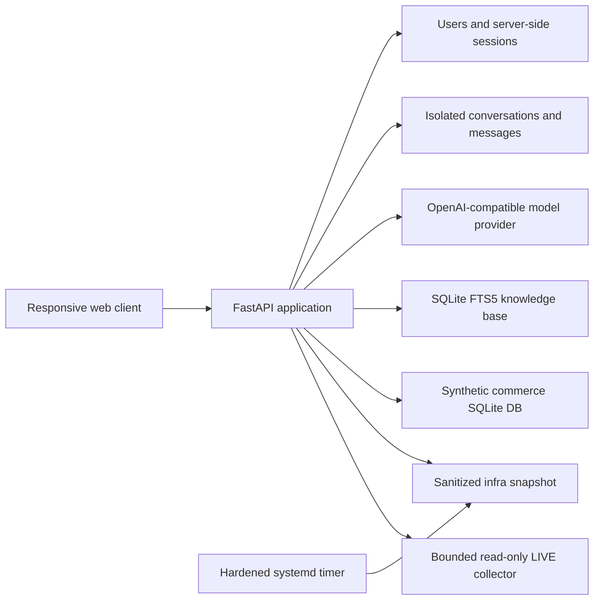

# NexusChat

NexusChat is a private, self-hosted AI workspace built with FastAPI, SQLite, and a responsive vanilla JavaScript frontend. It combines a general assistant, an infrastructure assistant, and a synthetic-data SQL reporting agent in three isolated chat workspaces.

The production interface is primarily Slovak, while assistants are instructed to answer in the language used by the user.

Live deployment: [raizenko.cloud/nexus](https://raizenko.cloud/nexus/)

## Highlights

- Local accounts with bcrypt password hashing and server-side HTTP-only sessions
- Separate **Nexus**, **Infra**, and **Data** conversations and histories
- OpenAI Responses API support plus OpenAI-compatible Chat Completions endpoints
- Configurable model routing for each agent
- Local SQLite FTS5 retrieval-augmented generation (RAG)
- Sanitized infrastructure snapshot refreshed by a hardened systemd timer
- Admin-only LIVE Infra checks with a fixed read-only collector and audit logging
- Synthetic commerce database with natural-language-to-SQL reporting
- SQLite authorizer, query-only mode, time limit, row limit, and function denylist
- Admin control plane for users, models, RAG, and agent access policies
- Responsive desktop/mobile interface with accessible navigation and status controls
- Atomic user/assistant turn persistence and automatic legacy chat migration

## Agent workspaces

| Workspace | Purpose | Data boundary |
| --- | --- | --- |
| **Nexus** | General analysis, planning, writing, and optional RAG | Conversation history plus selected knowledge-base chunks |
| **Infra** | Server, service, TLS, health, port, memory, load, and disk questions | Sanitized snapshot or admin-only bounded LIVE collection; no arbitrary shell |
| **Data** | Management reports from natural language or direct SQL | A separate, deterministic, fully synthetic SQLite database |

Infra conversations include an in-chat `SNAPSHOT / LIVE` selector. Every Infra answer is labeled with its source and collection timestamp. LIVE remains admin-only even when ordinary users are allowed to use the snapshot-based Infra agent.

## Architecture



See [Architecture](docs/ARCHITECTURE.md), [Security](docs/SECURITY.md), and [Deployment](docs/DEPLOYMENT.md) for the detailed design.

## Technology stack

- Python 3.13
- FastAPI and Uvicorn
- SQLite, FTS5, and SQLite authorizer callbacks
- OpenAI Python SDK
- bcrypt
- Vanilla HTML, CSS, and JavaScript
- pytest and Playwright
- systemd and nginx for the reference deployment

## Quick start

### 1. Create an environment

```bash
python -m venv .venv
```

PowerShell:

```powershell
.\.venv\Scripts\Activate.ps1
python -m pip install -r requirements-dev.txt
Copy-Item .env.example .env
```

Linux/macOS:

```bash
source .venv/bin/activate
python -m pip install -r requirements-dev.txt
cp .env.example .env
```

Export the values from `.env` through your shell or process manager. At minimum, configure `OPENAI_API_KEY`, `NEXUS_DATABASE`, and `NEXUS_SECURE_COOKIES`.

### 2. Create an administrator

```bash
python -m nexus.cli --database ./data/nexus.sqlite3 create-admin \
  --name "Nexus Admin" \
  --email "admin@example.com" \
  --password "replace-with-a-strong-password"
```

### 3. Start the application

PowerShell:

```powershell
$env:NEXUS_DATABASE="$PWD\data\nexus.sqlite3"
$env:NEXUS_SYNTHETIC_DATABASE="$PWD\data\synthetic-business.sqlite3"
$env:NEXUS_INFRA_SNAPSHOT="$PWD\data\infra-snapshot.json"
$env:NEXUS_SECURE_COOKIES="0"
python -m uvicorn nexus.app:app --reload
```

Open [http://127.0.0.1:8000/](http://127.0.0.1:8000/).

The synthetic reporting database is created and seeded automatically. Infra snapshot requests return a clear unavailable-state response until a snapshot file exists; LIVE Infra collection is intended for Linux hosts.

## Configuration

| Variable | Purpose | Default |
| --- | --- | --- |
| `OPENAI_API_KEY` | API credential for the selected provider | empty |
| `OPENAI_BASE_URL` | Optional OpenAI-compatible endpoint | OpenAI Responses API |
| `NEXUS_DATABASE` | Main application SQLite database | `/opt/nexuschat/data/nexus.sqlite3` |
| `NEXUS_SYNTHETIC_DATABASE` | Isolated synthetic report database | `/opt/nexuschat/data/synthetic-business.sqlite3` |
| `NEXUS_INFRA_SNAPSHOT` | Sanitized snapshot JSON path | `/opt/nexuschat/data/infra-snapshot.json` |
| `NEXUS_DEFAULT_MODEL` | General assistant model | `gpt-5.6-terra` |
| `NEXUS_INFRA_MODEL` | Infra assistant model | general model |
| `NEXUS_DATA_MODEL` | SQL/reporting model | general model |
| `NEXUS_SECURE_COOKIES` | Restrict session cookies to HTTPS | `1` |

Runtime model names, system instructions, RAG limits, and agent access policies are managed in the admin control plane and persisted in SQLite.

## Tests

Run the API, storage, security, migration, and agent tests:

```bash
python -m pytest -q
```

Run the full local desktop/mobile browser smoke test after installing Playwright Chromium:

```bash
python -m playwright install chromium
python tests/ui_smoke_runner.py
```

## Repository layout

```text
nexus/
  app.py          FastAPI routes, authorization, agent routing
  store.py        SQLite schema, migrations, sessions, RAG persistence
  ai.py           OpenAI and OpenAI-compatible provider adapter
  rag.py          validation, chunking, and FTS5 search helpers
  infra.py        snapshot parsing and bounded LIVE collection
  data_agent.py   synthetic database and SQL sandbox
  static/         responsive single-page frontend
tests/            API, persistence, security, and Playwright tests
deploy/           sanitized systemd and nginx examples
docs/             architecture, security, and deployment notes
```

## Operational notes

- Keep `/etc/nexuschat.env` or the equivalent environment file outside the repository.
- Back up SQLite with its native `.backup` command while the application is running.
- Run the web service as an unprivileged user.
- Do not grant the LIVE Infra agent an unrestricted shell or sudo access.
- Review and adapt the fixed service names and health endpoints in `nexus/infra.py` for your host.
